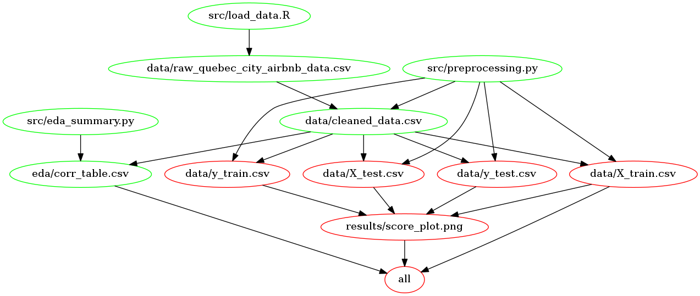

# DSCI_522_Group313 - AirBnb Price Predictor
Milestone 3 Repository
- Authors: Suvarna Moharir, Jaekeun Lee, Chimaobi Amadi

A data analysis project for DSCI 522 (Data Science Workflows), a course as part of the Master of Data Science program at the University of British Columbia.

## File Structure

```
.
├── Dockerfile
├── Makefile
├── Makefile.png
├── README.md
├── data
│   └── README.md
├── docs
│   ├── CODE_OF_CONDUCT.md
│   ├── CONTRIBUTING.md
│   ├── LICENSE
│   ├── citations.bib
│   ├── final_report.Rmd
│   ├── final_report.md
│   └── proposal.md
├── eda
│   ├── README.md
│   ├── heatmap.png
│   ├── price_linearanalysis1.png
│   ├── price_linearanalysis2.png
│   └── price_linearanalysis3.png
├── results
│   ├── README.md
│   ├── score_plot.png
│   └── score_summary.png
└── src
    ├── README.md
    ├── eda_summary.py
    ├── exploratory_analysis.ipynb
    ├── load_data.R
    ├── model.py
    ├── preprocessing.ipynb
    └── preprocessing.py
```

<br>

## About

In our project, we attempt to build a regression model using multiple linear regression, generalized linear regression, and random forest regression to find the best predictors for the price per night of an Airbnb in Quebec city. Airbnbs are often a popular option for those who are looking for low-cost, short-term rentals, and can often be a source of secondary income for hosts. 

For the Random Forest Regressor, the 10 most important features were:

1.  `accommodates`, the number of individuals the unit can accommodate.
2.  `bathrooms`, the number of bathrooms in the unit.
3.  `longitude`, the longitude of the rental unit.
4.  `calculated_host_listings_count_entire_homes`, which were the number
    of houses each host had up.
5. `calculated_host_listings_count`, which were the number of listings
    each host had up.
6.  `bedrooms`, the number of bedrooms in the unit.
7.  `latitude`, the latitude of the rental unit.
8.  `minimum_nights`,the minimum number of nights the renter is required to rent the unit for. 
9.  `property_type_loft`, the property type being a loft.
10.  `reviews_per_month`, the average number of reveiws the listing received each month.

This analysis could prove useful for 2 major groups of individuals: (1) individuals who are looking to rent out one of their properties as an Airbnb, and are looking for a potential price to charge, and (2) individuals who currently rent out their properties as an Airbnb ('hosts'), and are trying to determine how best to increase the valuation of the rental property. 

<br>

## Usage

1. Go to the project root directory in your command prompt

> $ cd ~/YOUR_PATH/DSCI_522_Group313


2. Execute the Makefile with `all` command for the entire process

> $ make all


3. Use `clean` command to delete raw datafile and results

> $ make clean


## Using Docker
*note - the instructions in this section also depends on running this in a unix shell (e.g., terminal or Git Bash)*

To replicate the analysis, install [Docker](https://www.docker.com/get-started). Then clone this GitHub repository and run the following command at the command line/terminal from the root directory of this project:

```
docker run --rm -v /$(pwd):/DSCI_522_Group313 maobiamadi/group_313 make -C DSCI_522_Group313 all
```

To reset the repo to a clean state, with no intermediate or results files, run the following command at the command line/terminal from the root directory of this project:

```
docker run --rm -v /$(pwd):/DSCI_522_Group313 maobiamadi/group_313 make -C DSCI_522_Group313 clean
```

**For a detailed description of each scripts, please refer to the [README.md file in the src folder of this repo](https://github.com/UBC-MDS/DSCI_522_Group313/tree/master/src). **

<br>

## Report
The final report can be found [here](https://github.com/UBC-MDS/DSCI_522_Group313/blob/master/docs/final_report.md) 

<br>

## Dependencies
- R version 3.6.1 and R packages:
    - docopt == 0.6.1
    - tidyverse == 1.2.1
- Python version 3.7.3 and Python packages: 
    - pandas == 0.24.2
    - numpy == 1.16.4
    - sklearn == 0.22.1 
    - docopt == 0.6.2
    - altair == 4.0.0
    - XGBoost == 1.0.0
    - matplotlib == 3.1.2 
    - scikit-learn == 0.22.1
    - feather == 0.4.0
    - selenium == 3.141.0

## Dependency Graph



