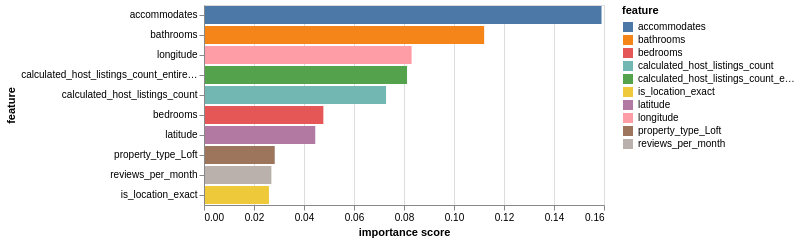

```{r setup, include=FALSE}
knitr::opts_chunk$set(echo = TRUE)
```

# Finding the best predictors of the per-night Airbnb price in Quebec City, QC.

## Summary
In our model, we built a regresion model using a Random Forest Regressor, XGB Regressor, and Support Vector Regression, along with cross-validation with GridSearchCV. The best model (best test score) was the Random Forest Regressor, which had a test accuracy of 75%. We did not implement model selection and features engineering, but plan to incorporate these concepts as well as test reproducibility of our findings on other AirBnb datasets. 

## Introduction
The Airbnb rental market has grown immensely since its inception in 2008. As of 2019, there are more than 7 million listings worldwide, and on average, there are 2 million people staying in an Airbnb per night. (@airbnb2019airbnb) Those renting out their properties as Airbnbs are called hosts, and are able to set and adjust their own prices. These often serve as an important source of secondary, or even primary income for hosts. There are many different factors that determine whether an individual will choose to rent an Airbnb or not, and new hosts often struggle with setting a fair and competitive price. There have been some peer-reviewed studies done in the past examining what the most important predictors are, and results range from host reviews (@teubner2017price) to the host having a profile picture (@ert2016trust). 

Here, we try to determine the most important predictors for the per-night price of an Airbnb in Quebec City. Answering this question is important because could help new hosts determine what price to set their rental at, as well as could help existing hosts determine what the most high-yield improvements could be if they'd like to raise the per-night price of their unit. 

## Methods
### Data
The data set used in this project is from Airbnb. Each year, Airbnb publishes data on their website for all the listings made that year, separated by major city. We used the Quebec City data set, as it is a Canadian city with a wide range of rental prices. 

The data contain many features, including the unit's geographic coordinates, the hosts' average ratings, and the number of beds in the unit.

We dropped all columns where all of the values were `NULL` or `NaN`. We also dropped all columns that were in French (as this was a Quebec data set). We then dropped rows with missing values; we chose not to replace these values with the mean/median in an attempt to avoid adding ambiguity to the analysis. The remaining rows and columns were split into an 80-20 train-test split, and were then preprocessed using sklearn's `StandardScaler` (for numeric features) and `OneHotEncoder` (for categorical features). 

In total, there are about 45 columns and 2,194 rows that we utilized in our review after removing blank/NaN-filled columns and rows. Each row in the data set is for a separate listing in Quebec City. 

### Exploratory Data Analysis (EDA)
During our exploratory data analysis, we generated scatter plots in order to examine the relationship of price with our other features. The features did not appear to have a linear relationship with our response variable, but, as expected, some of the other predictors were highly correlated with each other (e.g. `bedrooms` (the number of bedrooms), and `beds` (the number of beds)). 

Shown below is an example of a plot from the EDA, displaying the lack of linear relationships: 


*Figure 1: Plot from exploratory data analysis displaying relationships between response (price) and some features.*

From these distributions, it was clear that a multiple linear regression model would not be a good fit for our data. Thus, other regression methods (Random Forest Regression, XGB Regression, Support Vector Regression) were taken into consideration. 

### Analysis
For our model prediction, we have chosen Random Forest Regressor, XGBRegressor, and Support Vector Regressor as our models, in conjunction with cross validation technique using GridSearchCV. Cross validation helped in tuning different parameters to ensure optimal choice and results. We also chose the default accuracy metric. We have chosen these models because they have proven to have better predictive performances than other regressors, and because linear regression was not an option since our exploratory data analysis revealed an unclear linear relationship with our response variable `price`.

The R (@R) and Python (@Python) programming languages and the following R and Python packages were used to perform the analysis: Xgboost(@chen2016xgboost), docopt(@docopt), Matplotlib (@hunter2007matplotlib), tidyverse (@wickham2011testthat), Pandas (@mckinney2011pandas), Altair (@vanderplas2018altair), scikit-learn (@pedregosa2011scikit), Numpy (@walt2011numpy), and feather (@featherpy). The code used to perform the analysis and create this report is available [here](https://github.com/UBC-MDS/DSCI_522_Group313). 

## Results and Discussion

As a result of hyperparameter optimization, the model takes approximately 48 seconds to run and it fits different models and hyperparameters. The best model turns out to be Random Forest Regressor with test accuracy of 75%, followed by Support Vector Regressor with test accuracy of 66% and lastly XGBRegressor which was run without hyperparameter optimization as a control model with test accuracy of 63%. The makefile takes about 135 seconds (2 minutes, 15 seconds) to run. 


*Figure 2: This graph shows that the Random Forest Regressor had the highest test accuracy, which is why we chose that model to move forward with.*

The best set of hyperparameter for the best model: Random Forest Regressor is {'max_depth': 25, 'max_features': 'sqrt', 'min_samples_split': 2, 'n_estimators': 100}.


For the Random Forest Regressor, the 10 most important features were: 

1. `accomodates`, the number of individuals the unit can accomodate. 

2. `bathrooms`, the number of bathrooms in the unit. 

3. `longitude`, the longitude of the rental unit.

4. `calculated_host_listings_count_entire_homes`, which were the number of houses each host had up. 

5. `calculated_host_listings_count`, which were the number of listings each host had up.

6. `bedrooms`, the number of bedrooms in the unit. 

7. `latitude`, the latitude of the rental unit. 

8. `minimum_nights`, the minimum number of nights the renter is required to rent the unit for. 

9. `property_type_loft`, the property type being a loft. 

10. `reviews_per_month`, the average number of reviews the listing received each month. 

The following image summarizes the top 10 features as well as their feature scores: 

*Figure 3: Summary of the 10 most important features from the Random Forest Regressor, as well as their feature scores.* 

This shows that, perhaps new hosts could increse the number of units they have up on Airbnb, as well as potentially increasing the number of bathrooms in the unit, as well as increasing the number of individuals that can stay in the unit. They could also encourage their renters to leave a review of the unit on the Airbnb website. The longitude and latitude are not changeable, but perhaps a host could look into the latitude and longitude of a new property they are planning on purchasing if they intend to rent it out as an Airbnb. 

Some limitations of this model include the fact that feature engineering was not used, and this may have resulted in a less accurate model. Additionally, random forest regressors have a tendency to be less interpretable. For a larger data set, it may use up a lot of memory. Additionally, random forests have a tendency to overfit; we tuned the hyperparameters in an attempt to resolve this. Finally, some of our "most important features", namely `calculated host_listings_count_entire_homes` and `calculated_host_listings_count` are largely irrelevant to our research question. 

To improve this model in the future, we we will implement model selection and feature engineering so as to focus on the important features. We will also look into dropping the aforementioned irrelevant columns during the preprocessing stage. 

Another next step involves re-doing these analyses on other, larger Airbnb datasets (e.g. Vancouver) to observe whether these "most-important predictors" are generalizable to other datasets, or only apply to the Quebec City data set. 

## References 
