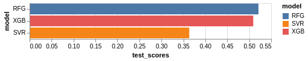

Final Report
================
Group 313
25/01/2020

# Finding the best predictors of the per-night Airbnb price in Quebec City, QC.

## Summary

In our model, we built a regresion model using a Random Forest
Regressor, XGB Regressor, and Support Vector Regression, along with
cross-validation with GridSearchCV. The best model (best test score) was
the Random Forest Regressor, which had a test accuracy of 75%. We did
not implement model selection and features engineering, but plan to
incorporate these concepts as well as test reproducibility of our
findings on other AirBnb datasets.

## Introduction

The Airbnb rental market has grown immensely since its inception in
2008. As of 2019, there are more than 7 million listings worldwide, and
on average, there are 2 million people staying in an Airbnb per night.
(Airbnb 2019) Those renting out their properties as Airbnbs are called
hosts, and are able to set and adjust their own prices. These often
serve as an important source of secondary, or even primary income for
hosts. There are many different factors that determine whether an
individual will choose to rent an Airbnb or not, and new hosts often
struggle with setting a fair and competitive price. There have been some
peer-reviewed studies done in the past examining what the most important
predictors are, and results range from host reviews (Teubner 2017) to
the host having a profile picture (Ert 2016).

Here, we try to determine the most important predictors for the
per-night price of an Airbnb in Quebec City. Answering this question is
important because could help new hosts determine what price to set their
rental at, as well as could help existing hosts determine what the most
high-yield improvements could be if they’d like to raise the per-night
price of their unit.

## Methods

### Data

The data set used in this project is from Airbnb. Each year, Airbnb
publishes data on their website for all the listings made that year,
separated by major city. We used the Quebec City data set, as it is a
Canadian city with a wide range of rental prices. Additionally, this
data set is relatively small (\~2700 rows), which we preferred as, given
the time constraints for this project, working with a huge data set
would have proven especially challenging.

The data contain many features, including the unit’s geographic
coordinates, the hosts’ average ratings, and the number of beds in the
unit. In total, there are about 45 columns that we utilized in our
review after removing blank/NaN-filled columns. Each row in the data set
is for a separate listing in Quebec City.

### Analysis

For our model prediction, we have chosen Random Forest Regressor,
XGBRegressor, and Support Vector Regressor as our models, in conjunction
with cross validation technique using GridSearchCV. Cross validation
helped in tuning different parameters to ensure optimal choice and
results. We also chose the default accuracy metric. We have chosen these
models because they have proven to have better predictive performances
than other regressors, and because linear regression was not an option
since our exploratory data analysis revealed an unclear linear
relationship with our response variable `price`.

The R (R Core Team 2019) and Python (Van Rossum and Drake 2019)
programming languages and the following R and Python packages were used
to perform the analysis: Xgboost(Chen 2016), docopt(de Jonge 2018),
Matplotlib (Hunter 2007), knitr(Xie 2014), tidyverse (Wickham 2017),
docopt(Keleshev 2014), Pandas (McKinney 2010), Altair (VanderPlas 2018).
The code used to perform the analysis and create this report is
available [here](https://github.com/UBC-MDS/DSCI_522_Group313).

## Results and Discussion

As a result of hyperparameter optimization, the model takes
approximately 48 seconds to run and it fits different models and
hyperparameters. The best model turns out to be Random Forest Regressor
with test accuracy of 75%, followed by Support Vector Regressor with
test accuracy of 66% and lastly XGBRegressor which was run without
hyperparameter optimization as a control model with test accuracy of
63%. 

Table 1: This graph shows that the Random Forest Regressor had the
highest test accuracy, which is why we chose that model to move forward
with.

The best set of hyperparameter for the best model: Random Forest
Regressor is {‘max\_depth’: 25, ‘max\_features’: ‘sqrt’,
‘min\_samples\_split’: 2, ‘n\_estimators’: 100}.

For the Random Forest Regressor, the 5 most important features were:

1.  `calculated_host_listings_count_entire_homes`, which were the number
    of houses each host had up.

2.  `bathrooms`, the number of bathrooms in the unit.

3.  `calculated_host_listings_count`, which were the number of listings
    each host had up.

4.  `longitude`, the longitude of the rental unit.

5.  `latitude`, the latitude of the rental unit.

This shows that, perhaps new hosts could increse the number of units
they have up on Airbnb, as well as potentially increasing the number of
bathrooms in the unit. The longitude and latitude are not changeable,
but perhaps a host could look into the latitude and longitude of a new
property they are planning on purchasing if they intend to rent it out
as an Airbnb.

To improve this model in the future, we we will implement model
selection and feature engineering so as to focus on the important
features and not risk dropping important features and using less
important ones. We will build a model pipeline and run analysis using
more regressors.

Another next step involves re-doing these analyses on other, larger
Airbnb datasets (e.g. Vancouver) to observe whether these
“most-important predictors” are generalizable to other datasets, or
only apply to the Quebec City data set.

## References

Van Rossum and Drake (2009) R Core Team (2019) de Jonge (2018) Wickham
et al. (2019) Wickham (2011) McKinney and others (2011) Walt, Colbert,
and Varoquaux (2011) Pedregosa et al. (2011) McKinney (2019) Chen and
Guestrin (2016) Hunter (2007) VanderPlas et al. (2018) Airbnb (2019)
Teubner, Hawlitschek, and Dann (2017) Ert, Fleischer, and Magen (2016)

Airbnb. 2019. “Airbnb Fast Facts.”

Chen, Tianqi, and Carlos Guestrin. 2016. “Xgboost: A Scalable Tree
Boosting System.” In *Proceedings of the 22nd Acm Sigkdd International
Conference on Knowledge Discovery and Data Mining*, 785–94.

de Jonge, Edwin. 2018. *Docopt: Command-Line Interface Specification
Language*. <https://CRAN.R-project.org/package=docopt>.

Ert, Eyal, Aliza Fleischer, and Nathan Magen. 2016. “Trust and
Reputation in the Sharing Economy: The Role of Personal Photos in
Airbnb.” *Tourism Management* 55: 62–73.

Hunter, John D. 2007. “Matplotlib: A 2D Graphics Environment.”
*Computing in Science & Engineering* 9 (3): 90–95.

McKinney, Wes. 2019. *Feather: Simple Wrapper Library to the Apache
Arrow-Based Feather File Format*. <https://github.com/wesm/feather>.

McKinney, Wes, and others. 2011. “Pandas: A Foundational Python Library
for Data Analysis and Statistics.” *Python for High Performance and
Scientific Computing* 14 (9).

Pedregosa, Fabian, Gaël Varoquaux, Alexandre Gramfort, Vincent Michel,
Bertrand Thirion, Olivier Grisel, Mathieu Blondel, et al. 2011.
“Scikit-Learn: Machine Learning in Python.” *Journal of Machine
Learning Research* 12 (Oct): 2825–30.

R Core Team. 2019. *R: A Language and Environment for Statistical
Computing*. Vienna, Austria: R Foundation for Statistical Computing.
<https://www.R-project.org/>.

Teubner, Timm, Florian Hawlitschek, and David Dann. 2017. “Price
Determinants on Airbnb: How Reputation Pays Off in the Sharing Economy.”
*Journal of Self-Governance & Management Economics* 5 (4).

VanderPlas, Jacob, Brian Granger, Jeffrey Heer, Dominik Moritz, Kanit
Wongsuphasawat, Arvind Satyanarayan, Eitan Lees, Ilia Timofeev, Ben
Welsh, and Scott Sievert. 2018. “Altair: Interactive Statistical
Visualizations for Python.” *Journal of Open Source Software* 3 (32):
1057.

Van Rossum, Guido, and Fred L. Drake. 2009. *Python 3 Reference Manual*.
Scotts Valley, CA: CreateSpace.

Walt, Stéfan van der, S Chris Colbert, and Gael Varoquaux. 2011. “The
Numpy Array: A Structure for Efficient Numerical Computation.”
*Computing in Science & Engineering* 13 (2): 22–30.

Wickham, Hadley. 2011. “Testthat: Get Started with Testing.” *The R
Journal* 3 (1): 5–10.

Wickham, Hadley, Mara Averick, Jennifer Bryan, Winston Chang, Lucy
McGowan, Romain François, Garrett Grolemund, et al. 2019. “Welcome to
the Tidyverse.” *Journal of Open Source Software* 4 (43): 1686.

