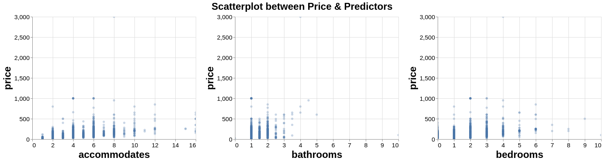
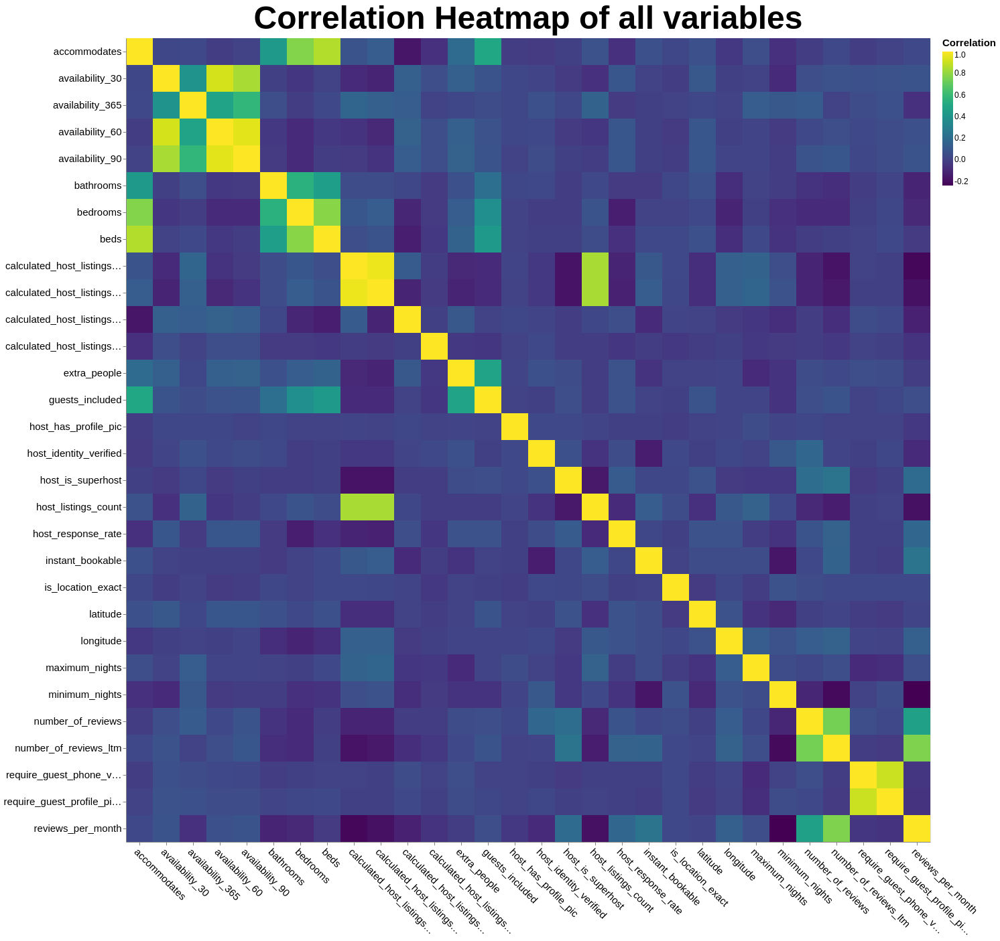

Final Report
================
Suvarna Moharir, Jaekeun Lee, and Chimaobi Amadi .
07-February-2020

# Finding the best predictors of the per-night Airbnb price in Quebec City, QC.

## Summary

In our model, we built a regression model using a Random Forest
Regressor, XGB Regressor, and Support Vector Regression, along with
cross-validation with GridSearchCV. The best model (best test score) was
the Random Forest Regressor. We did not implement model selection and
features engineering, but plan to incorporate these concepts as well as
test reproducibility of our findings on other AirBnb datasets.

## Introduction

The Airbnb rental market has grown immensely since its inception in
2008. As of 2019, there are more than 7 million listings worldwide, and
on average, there are 2 million people staying in an Airbnb per night
(Airbnb (2019)). Those renting out their properties as Airbnbs are
called hosts, and are able to set and adjust their own prices. These
often serve as an important source of secondary, or even primary income
for hosts. There are many different factors that determine whether an
individual will choose to rent an Airbnb or not, and new hosts often
struggle with setting a fair and competitive price. There have been some
peer-reviewed studies done in the past examining what the most important
predictors are, and results range from host reviews (Teubner,
Hawlitschek, and Dann (2017)) to the host having a profile picture (Ert,
Fleischer, and Magen (2016)).

Here, we try to determine the most important predictors for the
per-night price of an Airbnb in Quebec City. Answering this question is
important because it could help new hosts determine what price to set
their rental at, as well as could help existing hosts determine what the
most high-yield improvements could be if they would like to raise the
per-night price of their unit.

## Methods

### Data

The data set used in this project is from Airbnb. Each year, Airbnb
publishes data on their website for all the listings made that year,
separated by major city. We used the Quebec City data set, as it is a
Canadian city with a wide range of rental prices.

The data contain many features, including the unit’s geographic
coordinates, the hosts’ average ratings, and the number of beds in the
unit.

We dropped all columns where all of the values were `NULL` or `NaN`. We
also dropped all columns that were in French (as this was a Quebec data
set). We then dropped rows with missing values; we chose not to replace
these values with the mean/median in an attempt to avoid adding
ambiguity to the analysis. The remaining rows and columns were split
into an 80-20 train-test split, and were then preprocessed using
sklearn’s `StandardScaler` (for numeric features) and `OneHotEncoder`
(for categorical features).

In total, there are about 45 columns and 2,194 rows that we utilized in
our review after removing blank/NaN-filled columns and rows. Each row in
the data set is for a separate listing in Quebec City.

### Exploratory Data Analysis (EDA)

During our exploratory data analysis, we generated scatter plots in
order to examine the relationship of price with our other features. The
features did not appear to have a linear relationship with our response
variable, but, as expected, some of the other predictors were highly
correlated with each other (e.g. `bedrooms` (the number of bedrooms),
and `beds` (the number of beds)).

Shown below is an example of a plot from the EDA, displaying the lack of
linear relationships:

*Figure 1.1: Plot from exploratory data analysis displaying
relationships between response (price) and some features.*

From these distributions, it was clear that a multiple linear regression
model would not be a good fit for our data. Thus, other regression
methods (Random Forest Regression, XGB Regression, Support Vector
Regression) were taken into consideration.

*Figure 1.2: Heatmap of pearson correlation coefficient between selected
variables + response*

From the heatmap, we can clearly see that response doesn’t have strong
linear relationship with any of the variables. Also, we can vividly see
the high correlation clusters formed.

### Analysis

For our model prediction, we chose the 3 aforementioned models (Random
Forest Regressor, XGBRegressor, and Support Vector Regressor) as our
models, in conjunction with a cross validation technique using
GridSearchCV. Cross validation helped in tuning different parameters to
ensure optimal choice and results.

The R (R Core Team (2019)) and Python (Van Rossum and Drake (2009))
programming languages and the following R and Python packages were used
to perform the analysis: Xgboost(Chen and Guestrin (2016)), docopt(de
Jonge (2018)), Matplotlib (Hunter (2007)), tidyverse (Wickham (2011)),
Pandas (McKinney and others (2011)), Altair (VanderPlas et al. (2018)),
scikit-learn (Pedregosa et al. (2011)), Numpy (Walt, Colbert, and
Varoquaux (2011)), feather (McKinney (2019)), and selenium(Percival
(2014)).

The code used to perform the analysis and create this report is
available [here](https://github.com/UBC-MDS/DSCI_522_Group313).

## Results and Discussion

As a result of hyperparameter optimization, the model takes
approximately 48 seconds to run and it fits different models and
hyperparameters. The best model was the Random Forest Regressor with
test accuracy of 54%, followed by XGBRegressor with test accuracy, of
51%, and lastly, Support Vector Regressor which was run without
hyperparameter optimization as a control model, with a test accuracy of
36%. The makefile takes about 135 seconds (2 minutes, 15 seconds) to
run.

*Figure 2: This graph shows that the Random Forest Regressor had the
highest test accuracy, which is why we chose that model to move forward
with. XGBoost, and especially SVR, had lower test accuracies than the
Random Forest Regressor, and were thus eliminated from consideration.*

The best set of hyperparameters for the best model, Random Forest
Regressor, are: - `max_depth`: 25; the maximum depth of the tree is 25.
- `max_features`: `sqrt`; the number of features to consider when
looking for the best split is the square root of the number of features.
- `min_samples_split`: 2; the minimum number of samples required to
split an internal node is 2. - `n_estimators`: 100; the number of trees
in the forest is 100.

For the Random Forest Regressor, the 10 most important features were:

1.  `accommodates`, the number of individuals the unit can accomodate.

2.  `bathrooms`, the number of bathrooms in the unit.

3.  `longitude`, the longitude of the rental unit.

4.  `calculated_host_listings_count_entire_homes`, which were the number
    of houses each host had up.

5.  `calculated_host_listings_count`, which were the number of listings
    each host had up.

6.  `bedrooms`, the number of bedrooms in the unit.

7.  `latitude`, the latitude of the rental unit.

8.  `property_type_loft`, the property type being a loft.

9.  `reviews_per_month`, the average number of reviews the listing
    received each month.

10. `is_location_exact`, whether or not the location the host posted is
    the exact location of the unit.

The following image summarizes the top 10 features as well as their
feature scores: 

*Figure 3: Summary of the 10 most important features from the Random
Forest Regressor, as well as their feature scores.*

This shows that, perhaps new hosts could increse the number of units
they have up on Airbnb, as well as potentially increasing the number of
bathrooms in the unit, as well as increasing the number of individuals
that can stay in the unit. They could also encourage their renters to
leave a review of the unit on the Airbnb website. The longitude and
latitude are not changeable, but perhaps a host could look into the
latitude and longitude of a new property they are planning on purchasing
if they intend to rent it out as an Airbnb.

Some limitations of this model include the fact that feature engineering
was not used, and this may have resulted in a less accurate model.
Additionally, random forest regressors have a tendency to be less
interpretable. For a larger data set, it may use up a lot of memory.
Additionally, random forests have a tendency to overfit; we tuned the
hyperparameters in an attempt to resolve this. Finally, some of our
“most important features”, namely `calculated
host_listings_count_entire_homes` and `calculated_host_listings_count`
are largely irrelevant to our research question.

To improve this model in the future, we we will implement model
selection and feature engineering so as to focus on the important
features. We will also look into dropping the aforementioned irrelevant
columns during the preprocessing stage.

Another next step involves re-doing these analyses on other, larger
Airbnb datasets (e.g. Vancouver) to observe whether these
“most-important predictors” are generalizable to other datasets, or
only apply to the Quebec City data set.

## References

Airbnb. 2019. “Airbnb Fast Facts.”

Chen, Tianqi, and Carlos Guestrin. 2016. “Xgboost: A Scalable Tree
Boosting System.” In *Proceedings of the 22nd Acm Sigkdd International
Conference on Knowledge Discovery and Data Mining*, 785–94.

de Jonge, Edwin. 2018. *Docopt: Command-Line Interface Specification
Language*. <https://CRAN.R-project.org/package=docopt>.

Ert, Eyal, Aliza Fleischer, and Nathan Magen. 2016. “Trust and
Reputation in the Sharing Economy: The Role of Personal Photos in
Airbnb.” *Tourism Management* 55. Elsevier: 62–73.

Hunter, John D. 2007. “Matplotlib: A 2D Graphics Environment.”
*Computing in Science & Engineering* 9 (3). IEEE Computer Society:
90–95.

McKinney, Wes. 2019. *Feather: Simple Wrapper Library to the Apache
Arrow-Based Feather File Format*. <https://github.com/wesm/feather>.

McKinney, Wes, and others. 2011. “Pandas: A Foundational Python Library
for Data Analysis and Statistics.” *Python for High Performance and
Scientific Computing* 14 (9).

Pedregosa, Fabian, Gaël Varoquaux, Alexandre Gramfort, Vincent Michel,
Bertrand Thirion, Olivier Grisel, Mathieu Blondel, et al. 2011.
“Scikit-Learn: Machine Learning in Python.” *Journal of Machine
Learning Research* 12 (Oct): 2825–30.

Percival, Harry. 2014. *Test-Driven Development with Python: Obey the
Testing Goat: Using Django, Selenium, and Javascript*. " O’Reilly Media,
Inc.".

R Core Team. 2019. *R: A Language and Environment for Statistical
Computing*. Vienna, Austria: R Foundation for Statistical Computing.
<https://www.R-project.org/>.

Teubner, Timm, Florian Hawlitschek, and David Dann. 2017. “Price
Determinants on Airbnb: How Reputation Pays Off in the Sharing Economy.”
*Journal of Self-Governance & Management Economics* 5 (4).

VanderPlas, Jacob, Brian Granger, Jeffrey Heer, Dominik Moritz, Kanit
Wongsuphasawat, Arvind Satyanarayan, Eitan Lees, Ilia Timofeev, Ben
Welsh, and Scott Sievert. 2018. “Altair: Interactive Statistical
Visualizations for Python.” *Journal of Open Source Software* 3 (32):
1057.

Van Rossum, Guido, and Fred L. Drake. 2009. *Python 3 Reference Manual*.
Scotts Valley, CA: CreateSpace.

Walt, Stéfan van der, S Chris Colbert, and Gael Varoquaux. 2011. “The
Numpy Array: A Structure for Efficient Numerical Computation.”
*Computing in Science & Engineering* 13 (2). IEEE Computer Society:
22–30.

Wickham, Hadley. 2011. “Testthat: Get Started with Testing.” *The R
Journal* 3 (1): 5–10.

